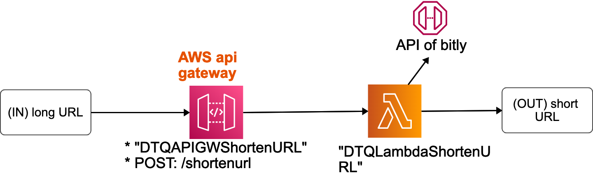
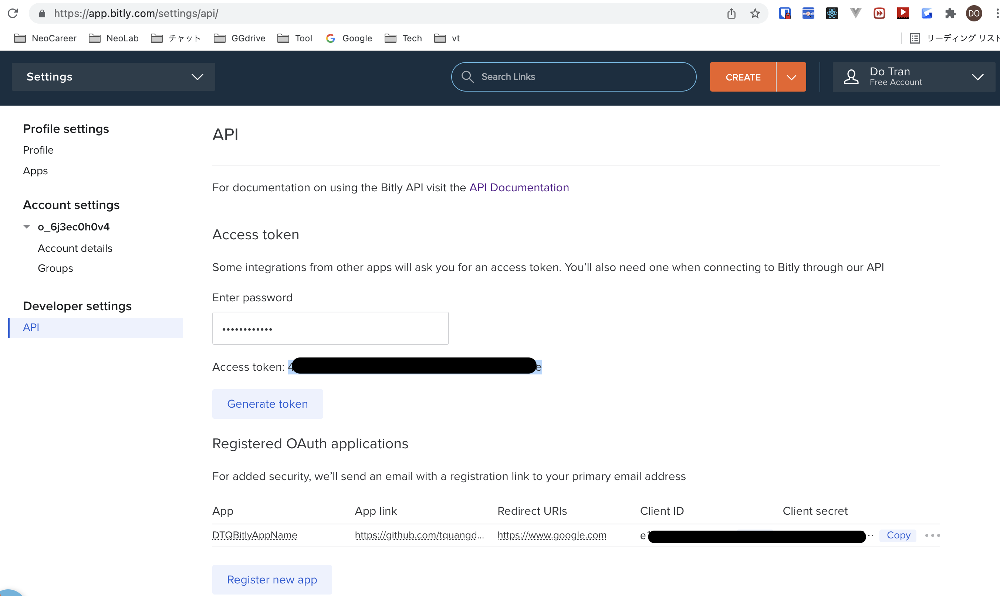
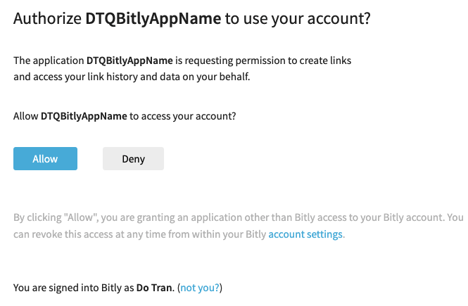
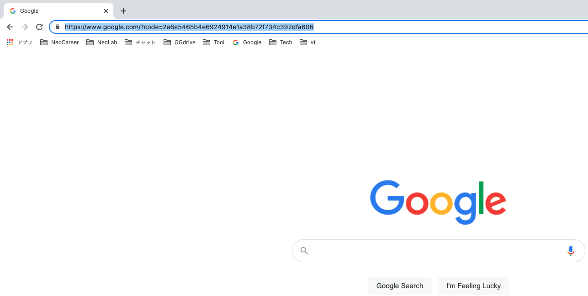
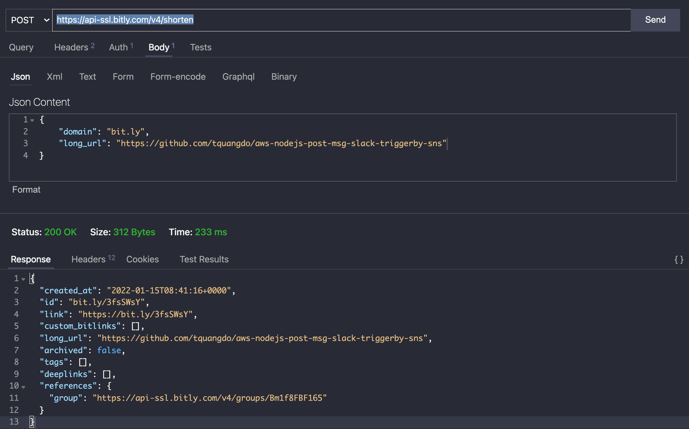
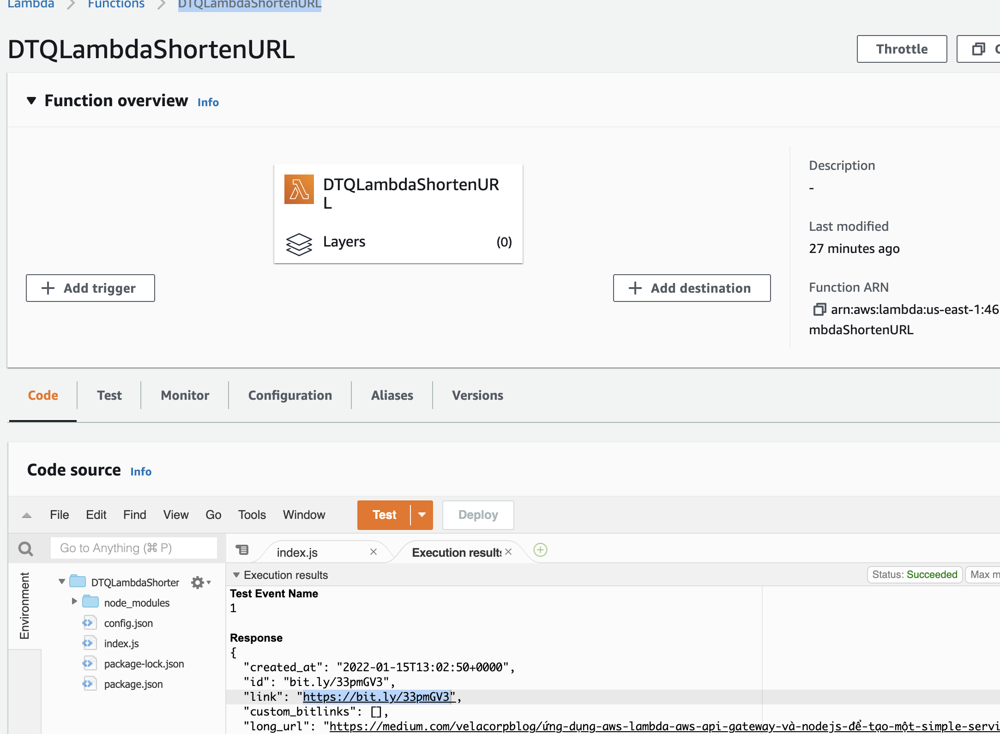
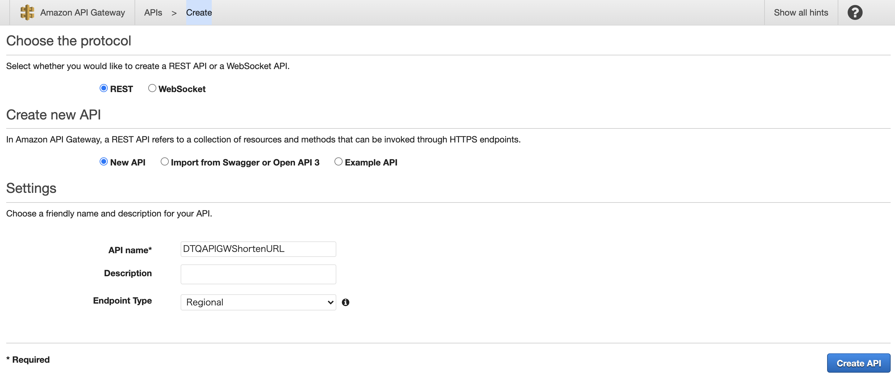
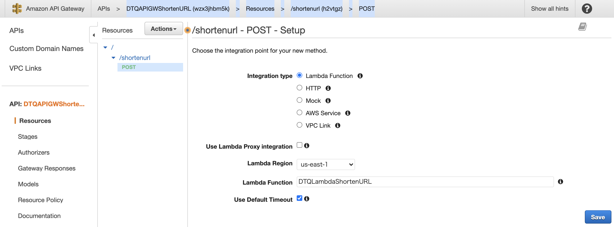
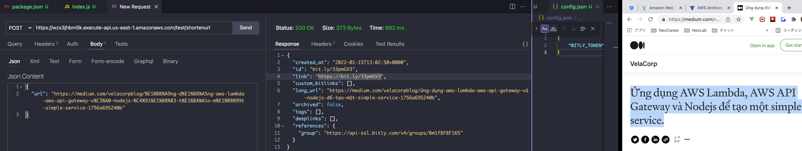

# aws-lambda-apigw-shortenurl-bitlyAPI 🐳


[](https://github.com/tquangdo/aws-lambda-apigw-shortenurl-bitlyAPI/issues/new)



## reference
[medium](https://medium.com/velacorpblog/ứng-dụng-aws-lambda-aws-api-gateway-và-nodejs-để-tạo-một-simple-service-1756a695240b)

## API bitly
+ register 1 acc
### A) OAuth credential (just refer, NOT in this repo!!!)
+ click `Register new app` > input `App name`, `App link` & `Redirect URI`

+ access `https://bitly.com/oauth/authorize?client_id=<xxx>&redirect_uri=https://www.google.com` on browser
+ will auto redirect confirm screen > redirect URI(google.com) with code:

+

### B) access token
+ click `Generate token` > will get access token
+ test POST API:
#### by CURL
```shell
curl \
-H 'Authorization: Bearer xxx' \
-H 'Content-Type: application/json' \
-X POST \
-d '{
  "long_url": "https://github.com/tquangdo/aws-nodejs-post-msg-slack-triggerby-sns",
  "domain": "bit.ly"
}' \
https://api-ssl.bitly.com/v4/shorten
->
{"created_at":"2022-01-15T08:41:16+0000","id":"bit.ly/3fsSWsY","link":"https://bit.ly/3fsSWsY","custom_bitlinks":[],"long_url":"https://github.com/tquangdo/aws-nodejs-post-msg-slack-triggerby-sns","archived":false,"tags":[],"deeplinks":[],"references":{"group":"https://api-ssl.bitly.com/v4/groups/Bm1f8FBF165"}}
```
#### by tool

+ test GET API
```shell
curl \
-H 'Authorization: Bearer xxx' \
-X GET \
https://api-ssl.bitly.com/v4/bitlinks/bitly.is/3nudTbo
->
{"created_at":"2022-01-15T08:33:31+0000","id":"bitly.is/3nudTbo","link":"https://bitly.is/3nudTbo","custom_bitlinks":[],"long_url":"https://dev.bitly.com/","title":"Introduction | Bitly Developer","archived":false,"created_by":"o_6j3ec0h0v4","client_id":"a5e8cebb233c5d07e5c553e917dffb92fec5264d","tags":[],"deeplinks":[],"references":{"group":"https://api-ssl.bitly.com/v4/groups/Bm1f8FBF165"}}
```

## lambda
+ create `DTQLambdaShortenURL`
+ test with input
```json
{
  "url": "https://medium.com/velacorpblog/%E1%BB%A9ng-d%E1%BB%A5ng-aws-lambda-aws-api-gateway-v%C3%A0-nodejs-%C4%91%E1%BB%83-t%E1%BA%A1o-m%E1%BB%99t-simple-service-1756a695240b"
}
```
+ will have result:


## api gateway
+ create `DTQAPIGWShortenURL`

+

+ deploy API and call POST API with final result (access shorten URL will redirect to `https://medium.com/velacorpblog/ứng-dụng-aws-lambda-aws-api-gateway-và-nodejs-để-tạo-một-simple-service-1756a695240b`):


